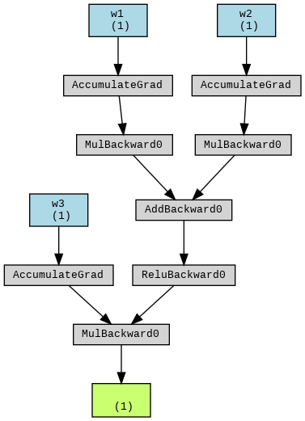

# Week 5 Quiz (3/17)

## Question
請利用 [pytorch_graph.ipynb](../code/pytorch_graph.ipynb) 畫出以下圖片



### Answer
只需要修改以下兩個 cell blocks:
```python
# 定義一個簡單的前向傳播模型
class SimpleNN(torch.nn.Module):
    def __init__(self):
        super(SimpleNN, self).__init__()
        self.w1 = nn.Parameter(torch.randn(1))
        self.w2 = nn.Parameter(torch.randn(1))
        self.w3 = nn.Parameter(torch.randn(1))
        self.relu = nn.ReLU()
    
    def forward(self, x1, x2):
        u = self.w1 * x1
        v = self.w2 * x2
        z1 = u + v

        a = self.relu(z1)
        y_hat = self.w3 * a

        return y_hat
```

```python
# 創建模型和輸入數據
model = SimpleNN()
x1 = torch.randn(1) # 隨機建立一個數字的 tensor
x2 = torch.randn(1) # 隨機建立一個數字的 tensor

# 計算前向傳播
output = model(x1, x2)

# 在此顯示
torchviz.make_dot(output, params=dict(model.named_parameters()))
```